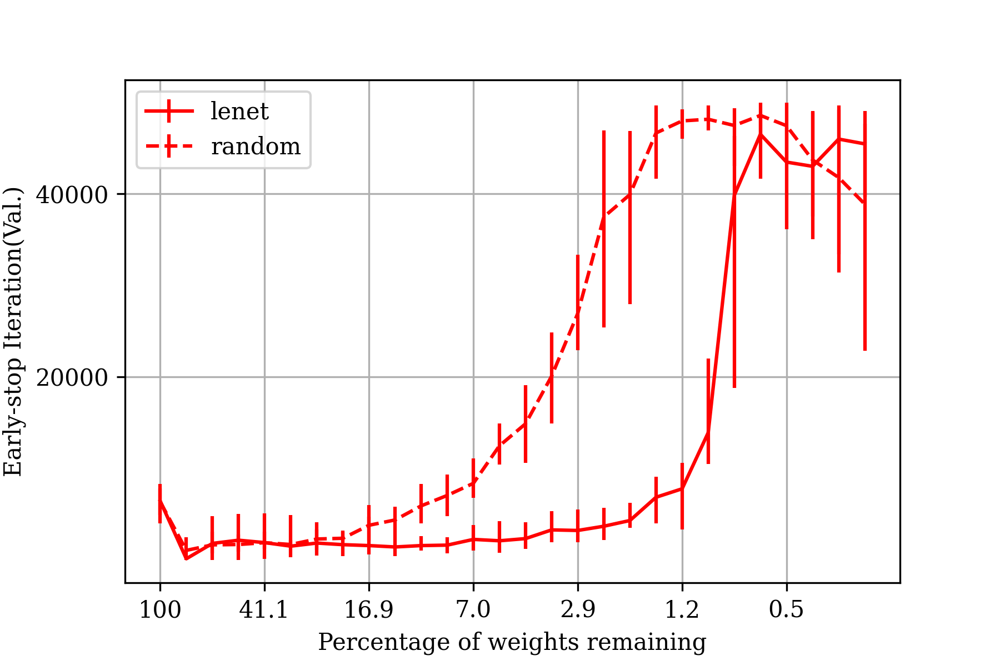
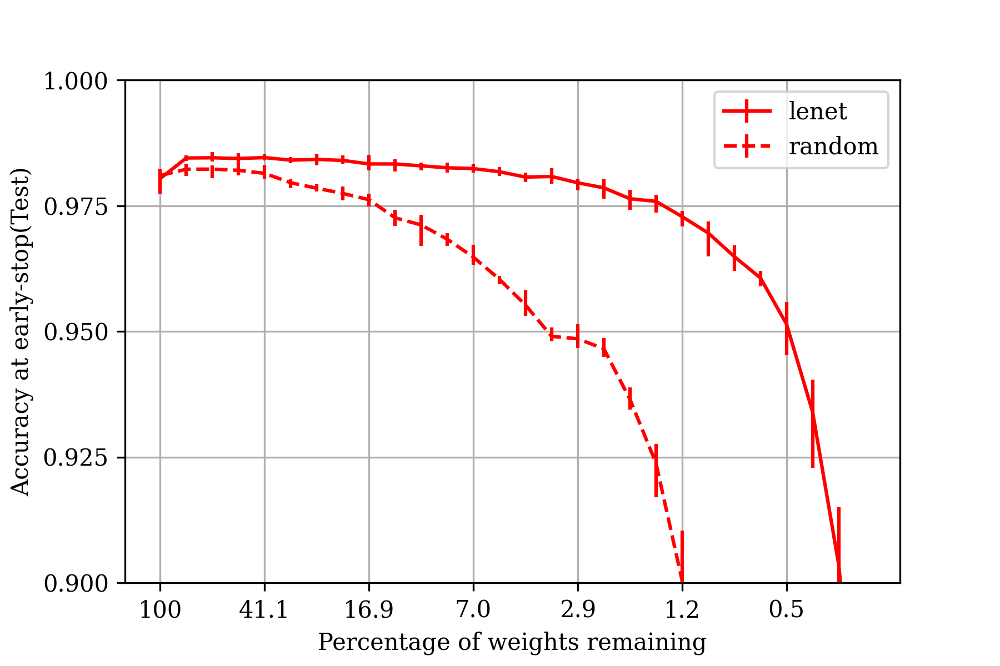
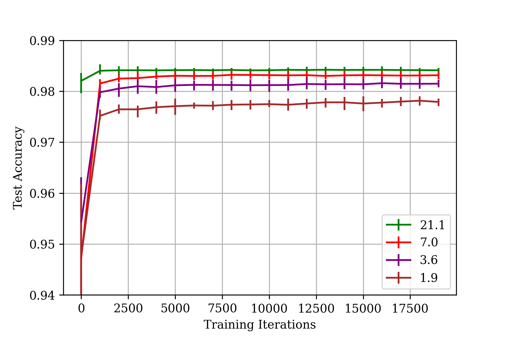
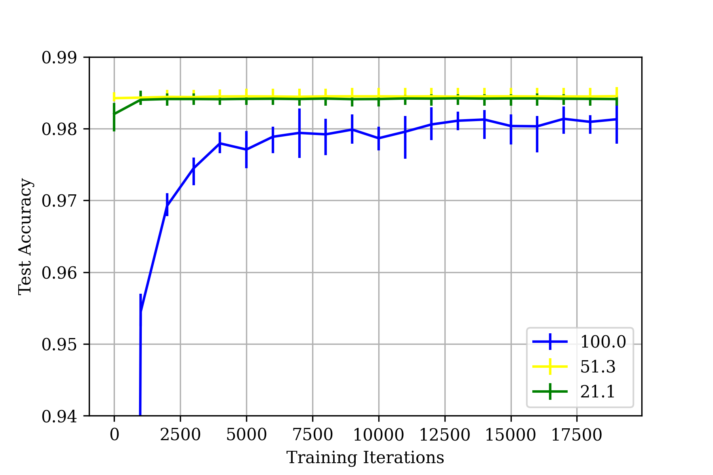

# Lottery Ticket Hypothesis
This repository reproduces experiments and figures of the paper [The Lottery Ticket Hypothesis: Finding Sparse, Trainable Neural Networks](https://arxiv.org/pdf/1803.03635.pdf).

## About pruning

The concept of neural network pruning is to reduce the parameter counts of trained networks, which in turn reduces storage requirements and improves computational performance of inference without compromising accuracy. However, sparse architectures produced by pruning are difficult to train from the start. The lottery ticket hypothesis suggests that randomly initialized feed-forward networks contain subnetworks (winning tickets) that achieve test accuracy comparable to the original network in a similar number of iterations when trained in isolation. These winning tickets have initial weights that make training particularly effective. Through experiments, researchers have consistently found winning tickets that are less than 10-20% of the size of several fully-connected and convolutional feed-forward architectures for MNIST and CIFAR10. Above this size, the winning tickets learn faster than the original network and reach higher test accuracy.

## How to run

If you want to run by yourself, you can get results by running

```
python3 experiment1.py <arch> <dataset>
```

Where you can ommit arch and dataset, in that case it is ran in default - architecture `lenet` and dataset `mnist`.

Options:
- arch:
  - `lenet`
  - `conv2`
  - `conv4`
  - `conv6`
- dataset:
  - `mnist`
  - `cifar10`
  
Keep in mind convolutional architectures are trained with `cifar10` and lenet with `mnist`.

## Checkpoints

For easy data extraction and reuse of trained models, there are checkpoints saves with describing filename of which trial, round and iteration they were trained.
To load and evaluate loss and accuracy of specific checkpoint, you can use `load_and_evaluate` function in [common.py](https://github.com/betusin/lottery-ticket/blob/main/common.py).

## Results

CSV files of data extracted from trained networks for creating figures.

## Figures

The resulting figures that confirm the investigated hypothesis.

**Description taken from paper**

Figure 1: The iteration at which early-stopping would occur (left) and the test accuracy at that iteration
(right) of the Lenet architecture for MNIST when trained starting at various sizes. Dashed lines are randomly sampled
sparse networks (average of ten trials). Solid lines are winning tickets (average of five trials).





Figure 3: Test accuracy on Lenet (iterative pruning) as training proceeds. Each curve is the average
of five trials. Labels are Pm—the fraction of weights remaining in the network after pruning. Error
bars are the minimum and maximum of any trial.




